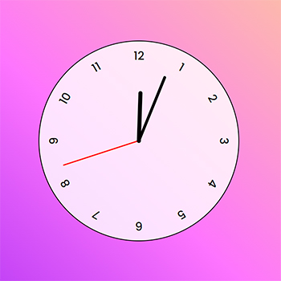

# Projeto Relógio

Um estudo feito em JavaScript onde foi desenvolvido um relógio analógico funcional.

## 🧾 Índice
- <a href="#Layout">Layout</a>
- <a href="#Tecnologias Utilizadas">Tecnologias Utilizadas</a>
- <a href="#Contato">Contato</a>

## 💻 Layout

## 📚 Tecnologias Utilizadas
- [x] HTML5
- [x] CSS3
- [x] JavaScript

## ✉️ Contato
[LinkedIn](https://www.linkedin.com/in/thiagotesilva/)